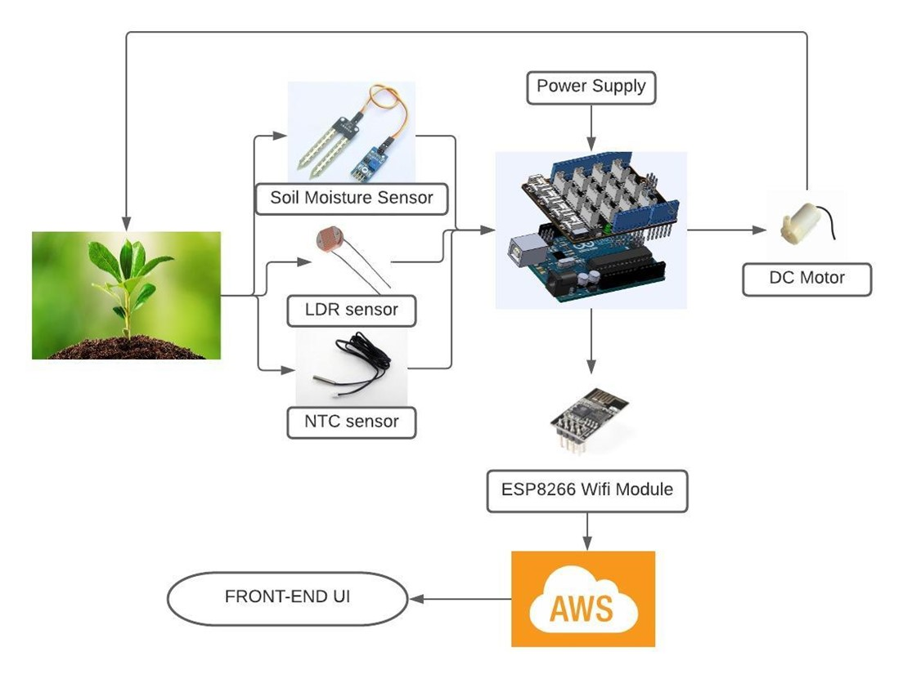

# AgriSense

## Overview
This is a robust IoT plant monitoring system that utilizes Arduino UNO, various sensors, Wi-fi module, connection to a cloud platform, plotting real time data,
and providing all the sensory data in a front-end user interface to keep track of all the data at the convenience of the user. 

## Block Diagram

